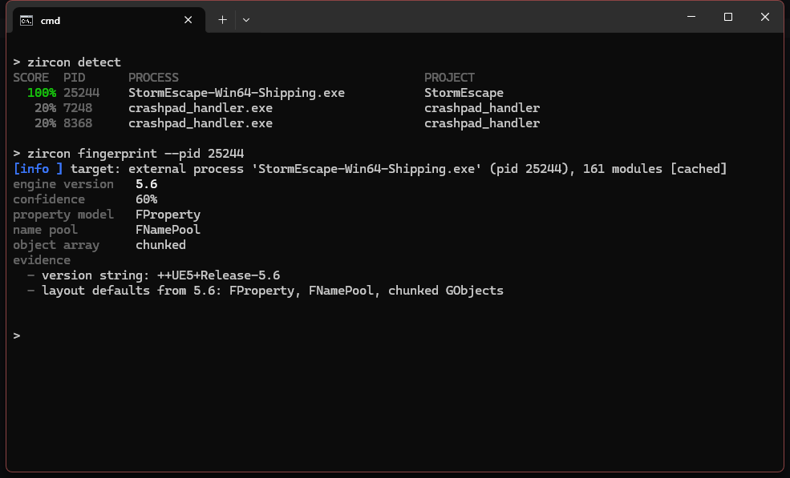
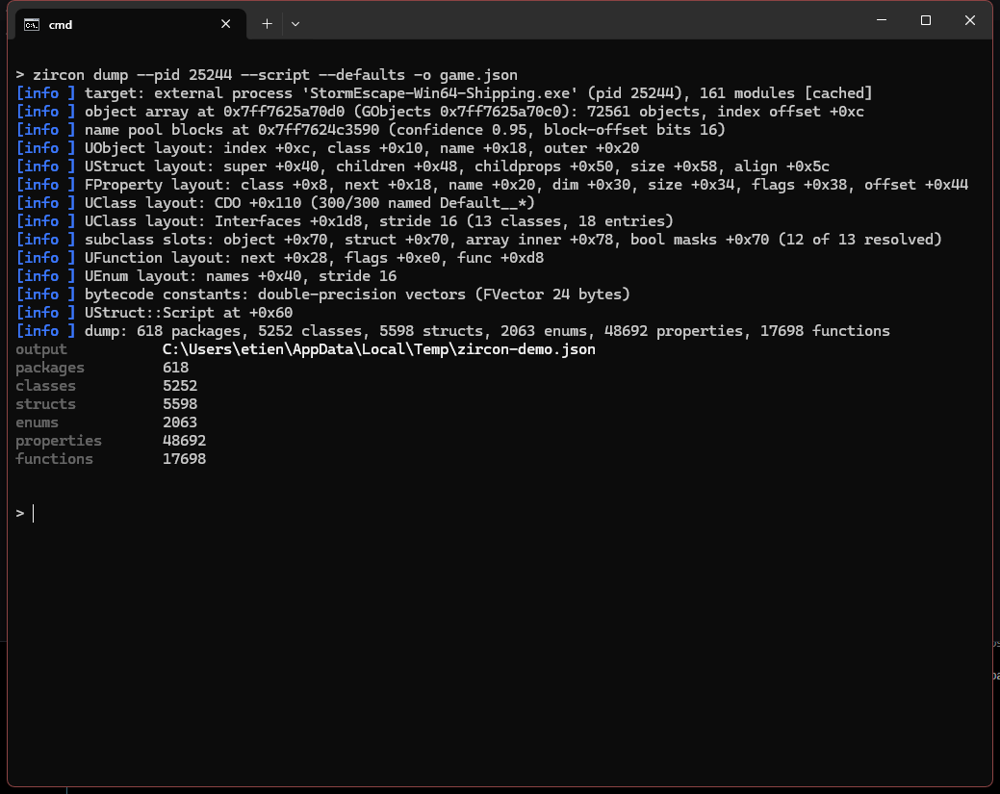
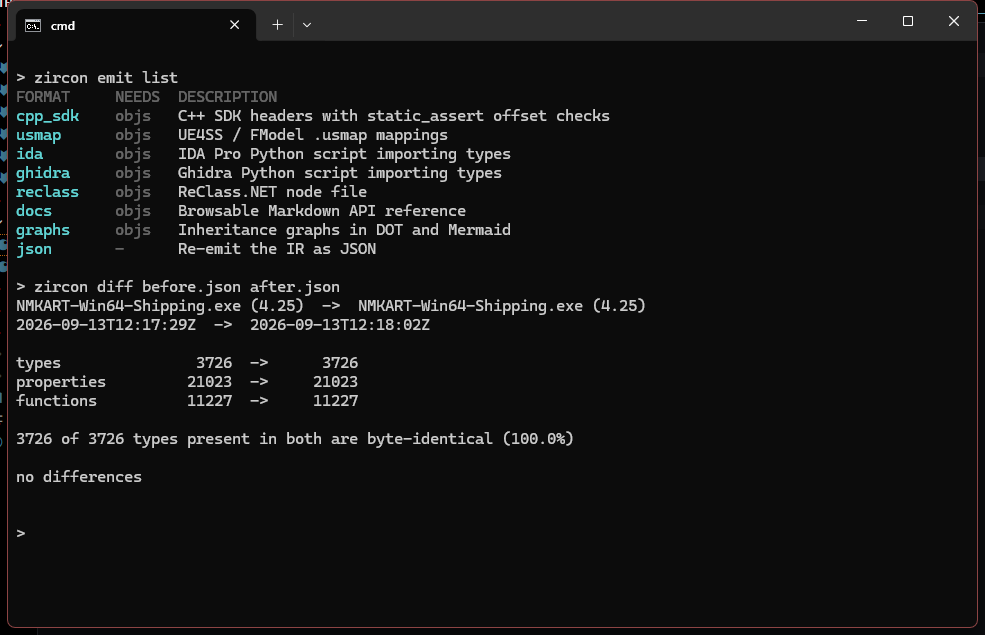
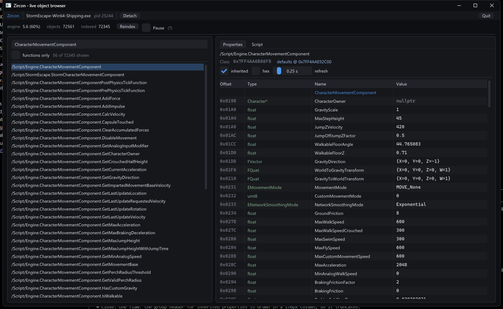
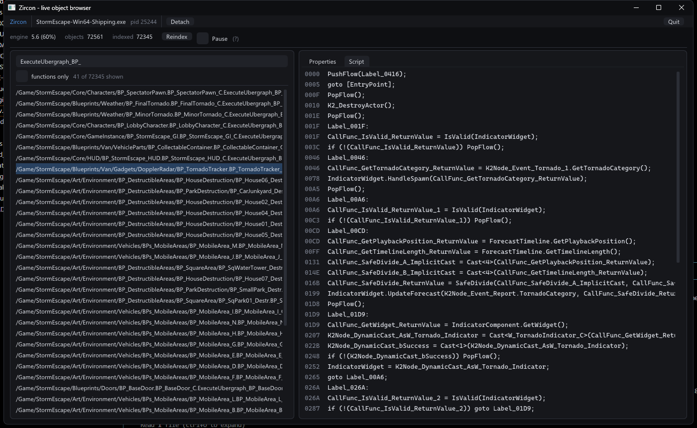
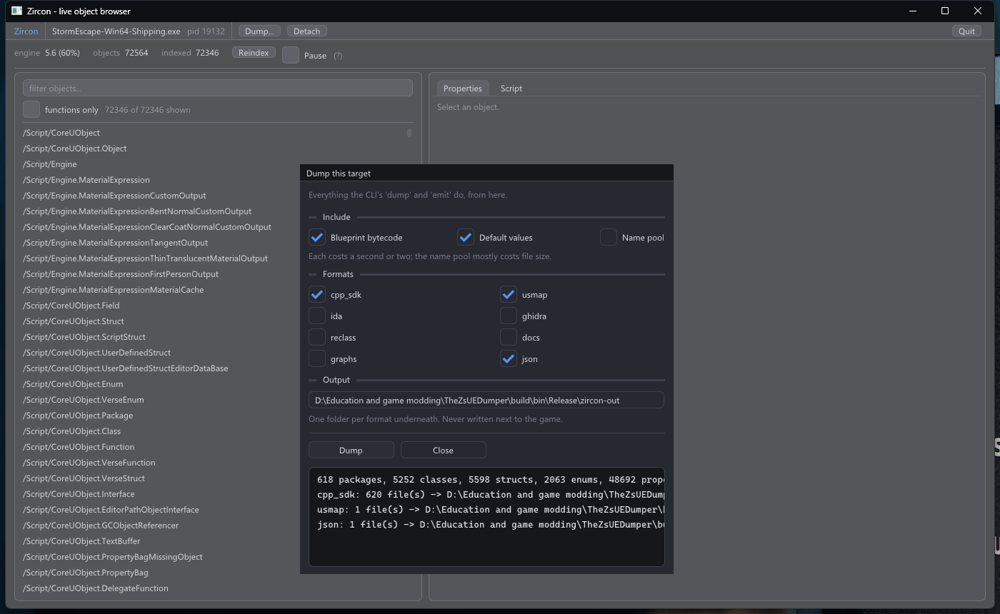
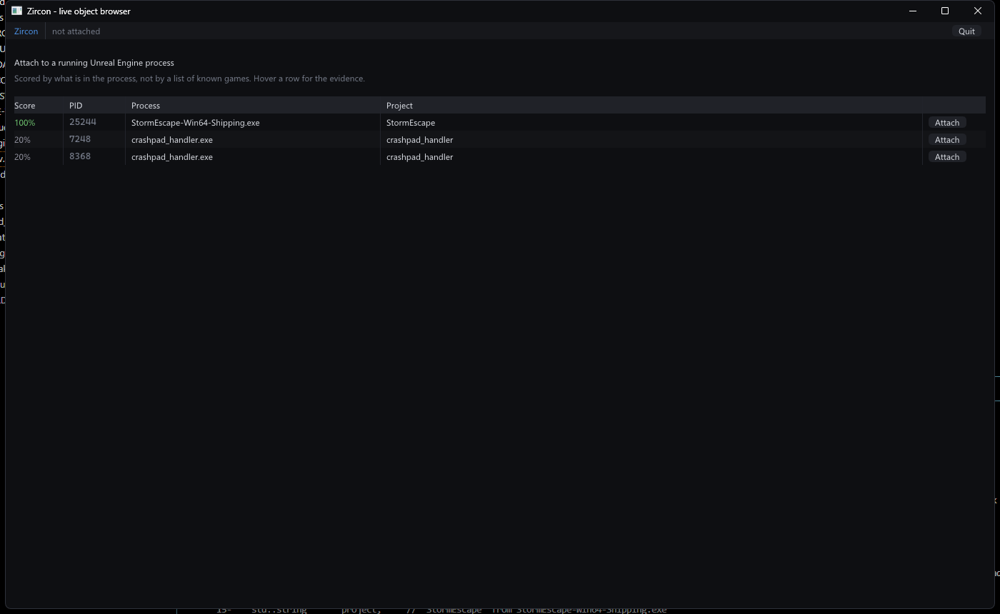

> **AI assistance:** the docs and the source comments were written with AI assistance, and I
> used it for implementation help and bug fixes too. Architecture, design, testing and debugging
> are mine — see [docs/UE-Test.md](docs/UE-Test.md) for what was actually run, and
> [CONTRIBUTING.md](CONTRIBUTING.md#ai-assistance) for the full statement.


# Zircon

**Game engine reflection extraction and analysis toolkit.**

Point it at an Unreal game — running, crashed, or just sitting on disk — and get back the
engine's entire type system: every class, struct, enum, property offset, function
signature and Blueprint script. Then turn that into a C++ SDK, a `.usmap`, types for IDA,
Ghidra or Binary Ninja, Frida bindings, Python stubs, readable Blueprint logic, or a report
on what a patch just broke.

Since 0.6.0 it does the same for **Unity IL2CPP** games: every C# type, field offset,
method RVA and enum value, out of the running game.

<sub>Sixteen Unreal games verified · UE 4.22 → 5.7 · both property systems · both name
pools · plus Unity IL2CPP · <b>no engine-version table anywhere in the codebase</b></sub>

<sub>Cross-checked against Dumper-7 on the same UE 5.6 game:
<b>26,625 of 26,625 shared member offsets agree exactly</b>, with 48,535 data members
emitted against its 44,701. And cross-checked against itself: the same game dumped from
outside, from inside, and from a 7 GB minidump gives <b>10,850 of 10,850 types
byte-identical</b> three ways.</sub>

---

## Pick your door

<table>
<tr>
<td width="50%" valign="top">

### 🎮 &nbsp;[I want to **use** it](#users)

Dump a game, generate an SDK, browse live objects, and find out where the files went.
Written for people who just want the output.

**[Get started →](#get-started-in-four-commands)**

</td>
<td width="50%" valign="top">

### 🔧 &nbsp;[I want to know **how it works**](#devs)

Derivation strategy, architecture, the IR contract, the plugin ABI, and an honest
comparison with Dumper-7 and UEDumper.

**[Read the design →](#why-it-works-the-way-it-does)**

</td>
</tr>
</table>

---

<a id="users"></a>

# Part I · For users

*Everything in this half assumes no reverse-engineering background. If a term is needed,
it gets explained where it appears.*

---

## What Zircon gives you

### It finds the game for you

You don't tell Zircon which engine version to assume, and you don't pick your game from a
list of supported titles. It scores every running process on what is actually inside it,
then reads the engine version out of memory.



```
> zircon detect
SCORE  PID      PROCESS                          PROJECT
 100%  25244    StormEscape-Win64-Shipping.exe   StormEscape
  20%  7248     crashpad_handler.exe             crashpad_handler
  20%  8368     crashpad_handler.exe             crashpad_handler

READY  PID      PROCESS                          RUNTIME
yes    22512    Road 96.exe                      Unity IL2CPP, GameAssembly.dll loaded

> zircon fingerprint --pid 25244
engine version    5.6
confidence        60%
property model    FProperty
name pool         FNamePool
object array      chunked
evidence
  - version string: ++UE5+Release-5.6
  - layout defaults from 5.6: FProperty, FNamePool, chunked GObjects
```

`100%` is your game. The 20% rows are the helper processes every launcher spawns. Hover
or use `-v` to see the evidence behind each score.

### It dumps everything in one pass



```
> zircon dump --pid 25244 --script --defaults -o game.json
[info ] target: external process 'StormEscape-Win64-Shipping.exe' (pid 25244), 161 modules
[info ] object array at 0x7ff7625a70d0 (GObjects 0x7ff7625a70c0): 72561 objects, index offset +0xc
[info ] name pool blocks at 0x7ff7624c3590 (confidence 0.95, block-offset bits 16)
[info ] UObject layout: index +0xc, class +0x10, name +0x18, outer +0x20
[info ] UStruct layout: super +0x40, children +0x48, childprops +0x50, size +0x58, align +0x5c
[info ] FProperty layout: class +0x8, next +0x18, name +0x20, dim +0x30, size +0x34, flags +0x38, offset +0x44
[info ] UClass layout: CDO +0x110 (300/300 named Default__*)
[info ] UClass layout: Interfaces +0x1d8, stride 16 (13 classes, 18 entries)
[info ] UFunction layout: next +0x28, flags +0xe0, func +0xd8
[info ] UEnum layout: names +0x40, stride 16
[info ] bytecode constants: double-precision vectors (FVector 24 bytes)
[info ] UStruct::Script at +0x60
output            game.json
packages          618
classes           5252
structs           5598
enums             2063
properties        48692
functions         17698
```

Every one of those `[info]` lines is Zircon **working out** where a field lives in *this
specific build* — not looking it up in a table. `CDO +0x110 (300/300 named Default__*)` is
the shape of all of them: a candidate offset, and the independent check that confirmed it.

That is why it works on games patched yesterday, on studio-modified engines, and on engine
versions that did not exist when the tool was written.

The result is one JSON file containing the game's whole type system.

### It turns that into twelve different things

| You want… | Use | What you get |
|---|---|---|
| To write a cheat/mod in C++ | `cpp_sdk` | Headers with every class, correct offsets, compile-time checks, and callable wrappers for every reflected function (Unreal) |
| To read a Unity game's code | `csharp` | A C# source tree: one folder per assembly, one file per type, offsets and RVAs in the margin (IL2CPP and Mono) |
| To use UE4SS, FModel, or an asset tool | `usmap` | A `.usmap` mappings file |
| To reverse the binary in IDA Pro | `ida` | A Python script that imports every struct into your database |
| Same, but Ghidra | `ghidra` | The same, for Ghidra |
| To poke at memory by hand | `reclass` | A ReClass.NET project |
| To read the API like documentation | `docs` | Browsable Markdown with an index |
| Same, but Binary Ninja | `binja` | The same again, as a BN type import |
| To poke at a live game from JS | `frida_js` | A Frida module with real property accessors |
| To write Python against the game | `python_stubs` | `.pyi` stubs with completion and offsets |
| To see the class hierarchy | `graphs` | Inheritance graphs (DOT + Mermaid) |
| To script your own output | `json` | The raw IR, plus [plugins](#plugins) |



```
> zircon emit list
FORMAT        NEEDS  DESCRIPTION
cpp_sdk       objs   C++ SDK headers with static_assert offset checks
csharp        objs   C# source tree: one folder per assembly, one file per type
usmap         objs   UE4SS / FModel .usmap mappings
ida           objs   IDA Pro Python script importing types
ghidra        objs   Ghidra Python script importing types
binja         objs   Binary Ninja Python script importing types
reclass       objs   ReClass.NET node file
docs          objs   Browsable Markdown API reference
frida_js      objs   Frida JavaScript bindings with live property accessors
python_stubs  objs   Python .pyi type stubs for the whole type system
graphs        objs   Inheritance graphs in DOT and Mermaid
json          -      Re-emit the IR as JSON

> zircon emit cpp_sdk game.json -o out/
files written     620
  out/SDK/Basic.hpp
  out/SDK/Engine.hpp
  ... and 608 more
```

### It gives you the game from JavaScript and Python too

Not everyone wants a C++ SDK. `frida_js` writes one `zircon.js` you hand straight to
Frida, and every reflected property becomes a real accessor:

```js
var actor = Zircon.wrap(ptr('0x1F3A4C00'), '/Script/Engine.Actor');

console.log(actor.MaxWalkSpeed);   // 600
actor.MaxWalkSpeed = 1337;         // written through the derived offset
actor.bHidden = true;              // one bit — the other six bools in that byte survive
actor.MovementMode;                // "MOVE_Falling", not 3
```

Inherited properties need no qualifying, because `wrap` walks the super chain. Strings,
maps and delegates are refused rather than written, same rule as everywhere else in the
tool: their memory holds allocator state beside the value.

`csharp` writes the tree a decompiler would leave behind — the thing you actually open
when you want to know how a Unity game works:

```
Assembly-CSharp/
    Game/Actors/Player.cs
mscorlib/
    System/Collections/Generic/List_AchievementMono_.cs
```

```csharp
// Token: 0x02000161  Size: 0x38  Read from: both
public class ActivationLinker : MonoBehaviour, ISenderRpc
{
    public List<LinkedActivatables> AllLinkedActivatables; // 0x18
    public CaveRoom room;                                  // 0x20
    public bool generationComplete;                        // 0x30

    public void OnGenerationComplete(GameManagerCC manager){ } // RVA: 0x59F2D0
    public ActivationLinker(){ }                               // RVA: 0x59F810
}
```

Method bodies are empty, and every file says so at the top: a body is IL, and a dump holds
reflection data. Everything else is real — names, base types, interfaces, field offsets,
RVAs, enum values — so the tree is readable, greppable and diffable, which is what it is
for. On a metadata-only dump the offsets are absent and the files say that instead of
printing `0`.

`cpp_sdk` is the Unreal half of the same idea, and each refuses the other's dumps rather
than running a C# type through a C++ name mangler.

`python_stubs` is the same type system as `.pyi` stubs, so an editor completes it:

```python
class AActor(UObject):
    __size__: ClassVar[int] = 680
    __offsets__: ClassVar[Dict[str, int]] = {"Owner": 80, "MaxSpeed": 124, ...}
    Owner: Optional["AActor"]        # 0x0050(0x0008) = nullptr
    MaxSpeed: float                  # 0x007C(0x0004) = 600
    def SetOwner(self, NewOwner: Optional["AActor"]) -> None: ...  # rva 0x401000
```

Feed `__offsets__` to whatever you already read memory with.

### The SDK it writes can call the game

The headers do not only describe the layout. Every reflected function comes with a wrapper:

```cpp
inline class APawn* UPawnMovementComponent::GetPawnOwner() { ... }
```

Calling one needs two things wired up, and injecting alongside `zircon.dll` supplies both:

```cpp
ZirconSDK::BindToZirconPayload();
```

The second of those is `UObject::ProcessEvent`, a virtual whose position the engine does
not record anywhere. Zircon works it out by calling a function whose answer it already
knows, once, and bakes the result into the SDK it generates. See
[Editing values](#editing-values-live) for the safety note on that.

### It shows you the game while it runs

A live object browser — standalone, or opened from inside the game if you inject.



The object list is on the left with a filter box; the right pane is a table of
`Offset / Type / Name / Value`, re-read on a timer. Selecting
`/Script/Engine.CharacterMovementComponent` on a UE 5.6 game gives its real defaults:

```
Offset   Type                  Name                    Value
0x0198   Character*            CharacterOwner          nullptr
0x01A0   float                 GravityScale            1
0x01A4   float                 MaxStepHeight           45
0x01A8   float                 JumpZVelocity           420
0x01D0   float                 WalkableFloorZ          0.71
0x01D8   FVector               GravityDirection        {X=0, Y=0, Z=-1}
0x0231   EMovementMode         MovementMode            MOVE_None
0x0233   ENetworkSmoothingMode NetworkSmoothingMode    Exponential
0x0278   float                 MaxWalkSpeed            600
0x028C   float                 MaxAcceleration         2048
```

Enums resolve to their names rather than integers, object properties to their paths,
structs to their members, and unreadable memory says so instead of showing zeroes.

### It reads Blueprint scripts back into something readable



Roughly ninety Kismet opcodes, with names, properties and called functions resolved
through the same reflection data. Each line is prefixed with its bytecode offset:

```
0000  PushFlow(Label_0416);
0005  goto [EntryPoint];
001F  Label_001F:
001F  CallFunc_IsValid_ReturnValue = IsValid(IndicatorWidget);
003C  if (!(CallFunc_IsValid_ReturnValue)) PopFlow();
0046  CallFunc_GetTornadoCategory_ReturnValue = K2Node_Event_Tornado_1.GetTornadoCategory();
0078  IndicatorWidget.HandleSpawn(CallFunc_GetTornadoCategory_ReturnValue);
0207  K2Node_DynamicCast_AsW_Tornado_Indicator = Cast<W_TornadoIndicator_C>(CallFunc_GetWidget_ReturnValue);
0248  if (!(K2Node_DynamicCast_bSuccess)) PopFlow();
```

Available in the GUI's **Script** tab, and from the CLI as
`zircon script --pid 12345 -f <name>`.

### It lets you change values while the game runs

Tick **Allow edits** and the Value column becomes editable. Numbers, bools and enums,
written straight into the live process and read back to confirm. Details in
[Editing values](#editing-values-live).

### It finds objects by what they hold

The question a dump on its own cannot answer. Not "where does Health live" but "which
things have less than fifty of it".

```
> zircon find --pid 1234 --where MaxWalkSpeed>500 -n 4
OBJECT                                               PROPERTY        VALUE
/Script/Engine.Default__CharacterMovementComponent   MaxWalkSpeed    777
/Script/Engine.Default__Character.CharMoveComp       MaxWalkSpeed    600
```

`=`, `!=`, `<`, `>`, `<=`, `>=`, and enums compare by name, so
`--where MovementMode=MOVE_Falling` works. `-f` narrows to one class first.

### It tells you what an update broke

Dump before the patch, dump after, and `zircon diff` reports every class that changed
size, every property that moved, and every function that vanished — graded by how badly
it breaks code you already wrote.

```
> zircon diff before.json after.json
NMKART-Win64-Shipping.exe (4.25)  ->  NMKART-Win64-Shipping.exe (4.25)

types               3726  ->      3726
properties         21023  ->     21023
functions          11227  ->     11227

3726 of 3726 types present in both are byte-identical (100.0%)

no differences
```

### It puts a dump online if you want one there

`zircon publish` uploads a dump to [Zdex](https://zlogic.eu/zdex), which makes it
browsable, searchable and diffable without anyone installing anything.

```
> zircon publish game.json --label "1.4.2 (Steam)"
compressed       59.1 MB -> 3.4 MB (17.3x)
url              https://zlogic.eu/zdex/d/42
status           ready
```

Optional, opt-in, and off unless you ask. Details in [Publishing a dump](#publishing-a-dump).

---

## Three binaries — which one do you want?

Zircon builds three things. They are not alternatives to each other; they are three ways
into the same engine.

| | What it is | Use it when |
|---|---|---|
| **`zircon.exe`** | the command-line tool | almost always — it does everything, from outside the game |
| **`zircon-gui.exe`** | the live object browser | you want to look around a running game, or dump by clicking |
| **`zircon.dll`** | the injectable payload | you specifically want to be *inside* the process |

### "Is `zircon.dll` like Dumper-7's DLL — inject it and it dumps?"

**Yes, that exact model works.** Inject it and it dumps the SDK by itself, no interaction:

```
zircon inject --pid 12345
```

It attaches, derives the layout, writes a **C++ SDK, a `.usmap` and the full JSON dump**
to `zircon-out\` next to the DLL — and then, unlike a fire-and-forget dumper, it opens the
live browser in its own window so you can keep poking at the game. Close that window and
it unloads itself.

**But the important difference: you almost certainly don't need to inject at all.**
`zircon.exe` produces the same SDK, the same usmap, the same everything, by reading the
process from outside. Injection buys exactly one capability — the ability to *call* the
game's own functions — and if you don't need that, the external path is strictly safer,
because a bug in Zircon cannot crash a game it never wrote to.

So: Dumper-7's inject-and-done workflow is supported, it just isn't the default.

### "Can the GUI dump, or does it only browse?"

**It dumps.** There's a **Dump…** button in the top bar once you're attached.



The dialog holds the same choices the CLI has:

```
Dump this target
  Include    [x] Blueprint bytecode   [x] Default values   [ ] Name pool
  Formats    [x] cpp_sdk   [x] usmap   [ ] ida      [ ] ghidra
             [ ] reclass   [ ] docs    [ ] graphs   [x] json
  Output     ...\build\bin\Release\zircon-out
             [ Dump ]  [ Close ]

  618 packages, 5252 classes, 5598 structs, 2063 enums, 48692 properties, 17698 functions
  cpp_sdk: 620 file(s) -> ...\zircon-out\cpp_sdk
  usmap: 1 file(s) -> ...\zircon-out\usmap
  json: 1 file(s) -> ...\zircon-out\json
```

`cpp_sdk`, `usmap` and `json` are ticked by default. It runs on a background thread, so
the window stays alive and tells you what it is doing; the log at the bottom is what was
actually written.

While a dump is running the browser stops reading the game, and the Properties and Script
tabs say so. That's deliberate: one reader at a time is easier to be certain of than a
lock around every memory read.

It publishes too. **Publish…** sits next to Dump… and uploads a dump to
[Zdex](https://zlogic.eu/zdex) without leaving the window:

```
Publish to Zdex
  Dump     ...\zircon-out\json\MyGame_Win64_Shipping.json
  Game     MyGame            Build  1.4.2 (Steam)
  Notes

  [ Publish ]  [ Close ]  [ Open on Zdex ]
  done, ready
  https://zlogic.eu/zdex/d/9
```

It fills in the file from your last dump and the game from the attached process, so usually
only the build label needs typing. If you haven't stored a key yet it asks for one there,
into the same place `zircon login` uses. Cancelling mid-upload is safe — whatever reached
the server stays, and the next attempt carries on from it.

### "Is there an installer?"

No, and there shouldn't be. The whole tool is three files in a folder — an installer that
copied them somewhere else would create an uninstall problem without solving a real one.

What you probably actually wanted is `zircon` working from any directory, so:

```
zircon install
```

That adds the folder it's sitting in to **your** PATH. Per-user, no administrator rights,
nothing touched outside your own account. Open a new terminal afterwards and `zircon
detect` works from anywhere.

```
zircon uninstall
```

takes it back off. Existing PATH entries are never rewritten — it appends one entry and
removes that same one, and leaves everything else spelled exactly as it found it.

---

## Get started in four commands

### 0. Build it

You need **Visual Studio 2022** and **CMake**. Nothing else — ImGui and Lua ship inside
the repo.

```
cmake -S . -B build -G "Visual Studio 17 2022" -A x64
cmake --build build --config Release
```

Everything lands in `build\bin\Release\` — see
[Three binaries](#three-binaries--which-one-do-you-want) for what each one is.

Optional, but worth doing once:

```
zircon install
```

so `zircon` works from any folder instead of only that one.

### 1. Start your game, then find it

```
zircon detect
```

Note the PID of the row scoring highest.

### 2. Check Zircon understands it

```
zircon fingerprint --pid 12345
```

If this prints an engine version and some evidence, everything else will work. If it
can't, see [When something goes wrong](#when-something-goes-wrong).

### 3. Dump it

```
zircon dump --pid 12345 -o game.json
```

Takes a couple of seconds. Add options if you want more in the file:

| Flag | Adds | Costs |
|---|---|---|
| `--script` | decompiled Blueprint bytecode | a second or two |
| `--defaults` | every property's default value | a second or two |
| `--names` | the game's entire string pool | a bigger file |

For the full thing: `zircon dump --pid 12345 --script --defaults -o game.json`

### 4. Turn it into what you actually wanted

```
zircon emit cpp_sdk game.json -o out/
```

Swap `cpp_sdk` for any format from the table above. `zircon emit list` shows them all.

> Prefer clicking? [`zircon-gui.exe`](#can-the-gui-dump-or-does-it-only-browse) does steps
> 1–4 in one dialog. Prefer injecting? [`zircon inject`](#is-zircondll-like-dumper-7s-dll--inject-it-and-it-dumps)
> does them with no interaction at all.

---

## Where the files go

This trips people up, so here it is explicitly. **Nothing is ever written next to the
game.** Game folders are often read-only, and a silently failed write is worse than an
obvious one.

### When you run the CLI

| Command | Writes to |
|---|---|
| `zircon dump` | `dump.json` in the current folder, or wherever `-o` says |
| `zircon emit cpp_sdk … -o out/` | `out\SDK\*.hpp`, one header per package, plus `out\SDK.hpp` that includes them all |
| `zircon emit csharp … -o out/` | `out\<Assembly>\<Namespace>\Type.cs`, one file per top-level type |
| `zircon emit usmap … -o out/` | `out\<GameName>-Win64-Shipping.usmap` |
| `zircon emit ida … -o out/` | `out\zircon_ida.py` |
| `zircon emit ghidra … -o out/` | `out\zircon_ghidra.py` |
| `zircon emit binja … -o out/` | `out\zircon_binja.py` |
| `zircon emit frida_js … -o out/` | `out\zircon.js` |
| `zircon emit python_stubs … -o out/` | `out\zircon_sdk\*.pyi` plus `py.typed` |
| `zircon emit reclass … -o out/` | `out\<GameName>.reclass.xml` and `.rcnet` |
| `zircon emit docs … -o out/` | `out\index.md` plus one file per package |
| `zircon emit graphs … -o out/` | `out\inheritance.dot`, `.mmd`, and `out\packages\*` |
| `zircon emit json … -o out/` | `out\<GameName>.json` |

Everything else (`detect`, `classes`, `props`, `script`, …) prints to the console and
writes nothing.

### When you dump from the GUI

Into `zircon-out\` **next to `zircon-gui.exe`** by default, one folder per format
(`zircon-out\cpp_sdk\`, `zircon-out\usmap\`, …). The box in the dialog changes it.

### When you inject the DLL

`zircon.dll` writes to a **`zircon-out\` folder next to the DLL itself**:

```
zircon-out\
├── cpp_sdk\SDK\*.hpp      the C++ SDK
├── usmap\*.usmap          the mappings file
└── json\*.json            the full dump
```

So if you put `zircon.dll` in `C:\tools\`, look in `C:\tools\zircon-out\`.

---

## Browsing a live game

```
zircon-gui.exe
```

Pick your game from the list and hit **Attach**. Or skip the picker with
`zircon-gui.exe --attach 12345`. This is the *external* browser — it reads the game from
outside and never loads anything into it. (The injected payload opens this same browser;
see [Three binaries](#three-binaries--which-one-do-you-want).)



```
Attach to a running Unreal Engine process
Scored by what is in the process, not by a list of known games.

SCORE   PID     PROCESS                          PROJECT
 100%   25244   StormEscape-Win64-Shipping.exe   StormEscape        [ Attach ]
  20%   7248    crashpad_handler.exe             crashpad_handler   [ Attach ]
  20%   8368    crashpad_handler.exe             crashpad_handler   [ Attach ]
```

Type in the filter box to find something, click it, and the right pane fills in.

**What you're looking at.** If you select a *class* (like `CharacterMovementComponent`),
you get that class's **default values** — Unreal keeps one master copy of every class, and
that's where the designer-set values live. If you select an actual *instance* of something
in the running level, you get that object's current values, refreshed on a timer.

Handy bits:

- **inherited** — show properties the class inherited from its parents, grouped by which
  class declares them
- **hex** — show integers in hex
- **refresh** — how often to re-read (0.05s to 2s)
- **Pause** — stop reading, so values hold still while you look at them
- **(?)** — hover it to see every offset Zircon derived for this game
- The **Script** tab decompiles the selected function, if it's a Blueprint function
- **Dump…** writes an SDK and anything else you tick, without leaving the window
- **Allow edits** turns the Value column into a live editor, see
  [Editing values](#editing-values-live)

---

## Editing values live

Tick **Allow edits** in the top bar, then click any Value cell and type.

```
engine 5.6 (60%)   objects 72561   indexed 72345   [Reindex]  [ ] Pause  [x] Allow edits  writes on

Offset   Type      Name             Value
0x0278   float     MaxWalkSpeed     600     <- click, type 1337, press Enter
```

Enter commits, Escape cancels. The row re-reads straight afterwards, so if the game owns
that field and overwrites it on the next tick, you see it snap back. That is the useful
answer, not a bug.

**Holding a value.** Editing a field the game owns does nothing on its own, because the
next tick writes it back. Click the dot beside a value to freeze it and Zircon re-applies
it every 30ms, which beats a 60Hz tick. Frozen values are listed under the table and stay
frozen while you look at other objects.

**What can be edited:** numbers, bools, enums, and structs whose members are all numbers
(`FVector`, `FRotator`, `FLinearColor`). A struct takes either `{Z=-2}` or `0,1,-3`, and
a partial write leaves the rest alone. Enums take either the enumerator name
or its number, and integers take `0x` hex as well as decimal.

**What cannot:** strings, arrays, maps, object pointers, and structs holding any of
those. Their memory holds
allocator state and element counts alongside the value, and a plain byte write corrupts
that with no immediate symptom. Those cells stay plain text instead of offering an edit
that would be refused.

Three things the editor will not do to you:

- **It is off until you switch it on**, every session. The switch reaches the memory
  source itself, so while it is off a write is refused at the bottom of the stack.
- **It writes exactly the property's width.** Putting 300 into a `uint8` is refused
  rather than silently stored as 44.
- **It preserves neighbouring bits.** Seven bools commonly share one byte;
  `CharacterMovementComponent` packs seven into `0x02E8` alone. Setting one reads the
  byte, changes that bit, and writes it back.

The command line can do the same thing without the browser:

```
> zircon write --pid 1234 -f /Script/Engine.CharacterMovementComponent --set MaxWalkSpeed=777
object            /Script/Engine.CharacterMovementComponent
property          MaxWalkSpeed
was               600
now               777
```

It prints what the value was, because the quickest way to undo a mistake is to have been
shown what it replaced.

Editing is data, not code. Zircon does not patch instructions, install hooks or modify
the game's executable. See [What Zircon will not do](#what-zircon-will-not-do).

---

## Comparing two versions of a game

This is the one people don't expect and then use constantly.

```
zircon dump --pid 12345 -o before.json      … game updates …
zircon dump --pid 67890 -o after.json

zircon diff before.json after.json
```

You get a report of everything that changed, graded by severity. Add `--breaking` to see
only the changes that would break code you already wrote:

```
zircon diff before.json after.json --breaking
```

**It exits with code 8 if anything breaking changed**, so you can wire it into a build
script and have it fail automatically. `--style markdown` or `--style json` if you want
the report in a file instead.

---

## Checking a dump against itself

`zircon validate` has always said whether the file survives a round-trip. `--strict` asks
a different question: does what is *in* it make sense?

```
> zircon validate game.json --strict
round-trip       lossless
checked          10850 types, 48692 properties, 2063 enums

CHECK                        COUNT  SEVERITY
property-overlap                 2  error
dangling-type-ref              118  warning

  property-overlap         /Script/Engine.Actor.ReplicatedMovement
                           starts at 400 but AttachmentReplication runs to 408

warnings        118
errors            2
```

About twenty checks: members that overlap or run past the end of their class, two
non-bitfield properties at one offset, two bools claiming the same bit, an enum whose
underlying type cannot hold its own values, a super or a property type that is not in the
file, a function with two return values.

**Errors mean the dump contradicts itself**, so something upstream is wrong and whatever
you render from it will be wrong in the same place. **Warnings are unprovable from one
file** — a `--filter`ed dump legitimately has no ancestors to point at, so a dangling
reference is not automatically a defect.

Exit code is `9` when there are errors, which is a different code from `6` ("that file
would not parse") on purpose: a build script wants to tell those apart.

## Finding what points at a type

```
> zircon xref game.json -f CharacterMovementComponent
type              /Script/Engine.CharacterMovementComponent

extended by (14)
  /Game/Player/BP_PlayerMovement.BP_PlayerMovement_C
  ...
held by (31)
  /Script/Engine.Character.CharacterMovement
  ...
passed to (3)
  /Script/Engine.Character.SetCharacterMovement(NewMovement)

references        48
```

Inheritance, interfaces, properties that hold one, and function parameters that take one —
including through containers, so a `TMap<FName, TArray<AActor*>>` counts as a reference to
`AActor`. `--uses` runs it the other way and lists what the type reaches.

A leaf name is enough when it is unambiguous. When it is not, you get the candidates rather
than a silently picked one. Exit code `3` when nothing points at it.

## Doing it in one command

`dump` can render as it writes, which saves a second command and one chance to emit from a
stale file:

```
zircon dump --pid 12345 --script --defaults -o game.json --emit cpp_sdk,usmap
```

`emit` takes the same comma list, and `all` means every format:

```
zircon emit cpp_sdk,usmap,frida_js game.json -o out/
zircon emit all game.json -o out/
```

One format writes straight into `-o` the way it always has. Several get a subdirectory
each, because `docs` and `graphs` would otherwise write over one another. A format that
refuses does not stop the rest.

## Publishing a dump

[Zdex](https://zlogic.eu/zdex) indexes Zircon dumps and makes them browsable, searchable and
diffable in a browser — useful when you want to look something up without a dump on disk, or
hand a build to someone who isn't going to install anything.

Publishing is entirely optional. Nothing uploads unless you ask it to.

```
zircon login                                     paste your API key once
zircon publish game.json --label "1.4.2 (Steam)"
```

That prints a URL. `--label` is how you'll tell two builds apart later, so it's worth
filling in; `--game` is guessed from the process the dump came from and only needs saying
when the guess is wrong.

`--label auto` takes it from the dump instead — the image size of the module the dump came
from, which changes whenever the game is rebuilt and is the same across two runs of the same
build. A dump read from metadata alone has no loaded image, so there it says so rather than
making one up.

A whole batch goes up in one command, each dump named from its own header:

```
zircon publish dumps\ --all --label auto
```

A dump already published from this machine is skipped before the upload starts, not after —
Zdex refuses an identical dump anyway, and finding that out the other way costs the whole
upload. `--force` sends it regardless.

`login` takes an **API key**, not an account — get one from your Zdex profile. There's no
browser flow and no OAuth. The key lives in `%APPDATA%\Zircon\config.json` and nowhere else:
not in the dump, not in a log line, not in anything committed. `zircon logout` deletes it.

Dump and publish in one go:

```
zircon dump --pid 12345 --script --defaults -o game.json --publish --label "1.4.2"
```

Without `--publish` the dump just prints the command you'd need, so it's in front of you if
you want it and out of the way if you don't. The GUI has a **Publish…** button that does the
same thing — see [Can the GUI dump?](#can-the-gui-dump-or-does-it-only-browse).

Pulling things back down:

```
zircon fetch 42              the dump JSON
zircon fetch 42 --usmap      just the mappings
zircon fetch 42 --sdk        the generated SDK, as a zip
```

Uploads are gzipped, chunked and resumable — a dropped connection picks up where it stopped
instead of starting over. A 59 MB dump compresses to about 3 MB and takes a few seconds.
Publishing the same dump twice is not an error; the server recognises it and points you at
the one that's already there.

`--no-wait` returns as soon as the upload lands rather than waiting for indexing to finish,
and `--json` prints the result as JSON if you're scripting around it.

## Unity games

Zircon dumps Unity IL2CPP games as well as Unreal ones. Same commands, same dump format,
same emitters — `fingerprint` tells you which kind of game you're looking at, and everything
downstream reads the answer off the dump.

```
zircon fingerprint --pid 12345
```

```
runtime           Unity IL2CPP
module            GameAssembly.dll at 0x7ffc1fc60000
api               39/39 entry points resolved
confidence        98%
evidence
  - GameAssembly.dll exports 237 il2cpp_* entry points; 39 of 39 the walk needs resolved
  - every entry point resolved by name, so no metadata version is involved
```

### Two ways to read a Unity game, and a third that is both

A Unity game keeps its type system in two places, and each holds a half the other doesn't.

| | `--mode live` | `--mode static` | `--mode dual` |
|---|---|---|---|
| needs the game running | yes | **no** | yes |
| type set | grows as the game runs | **exact, repeatable** | metadata's |
| field offsets | **yes** | no | live's |
| method addresses | **yes** | no | live's |
| concrete generics (`List<int>`) | **yes** | no | live's |
| names, namespaces, tokens | yes | yes | both, cross-checked |
| APK, console, anti-cheat, a game that crashes | no | **yes** | static half |

**Live** is the default and needs injection — see below. **Static** reads
`global-metadata.dat` off disk and needs no process at all:

```
zircon dump --metadata "D:\Games\Thing\Thing_Data\il2cpp_data\Metadata\global-metadata.dat" -o thing.json
```

That works on games this machine cannot run, on targets with anti-cheat, and on Road 96 —
which has never once completed a live walk and dumps this way in seconds: 191 assemblies,
18,277 types, 118,319 methods. It is an honest partial answer and says so: field types,
offsets and method addresses are not in the metadata, they are in the binary, so they come
back unresolved rather than invented.

**Dual** runs both and merges them:

```
zircon inject --launch "D:\Games\Thing\Thing.exe" --wait --headless --mode dual -o thing.json.gz
```

```
merged: 12318 types in both, 36244 only the runtime had, 841 only the metadata declared
```

Every record says which side it came from, and every disagreement between them goes in the
dump header rather than being resolved quietly — on a packed build the disagreement is the
point.

**No version table anywhere in this.** Every other IL2CPP dumper parses that metadata file
with a per-version table of struct layouts and breaks on each Unity release. Zircon works the
layout out from constraints the file cannot satisfy by accident — the spans tile the file, the
identifier blob is the one made of names, a record table's leading int32s all land on one, and
a `(start, count)` pair partitions the table it indexes. Measured across metadata versions 24,
27, 29, 31 and 39: ten of eleven installed games solve, and the eleventh refuses with its
reason rather than guessing. `docs/IL2CPP.md` has the whole argument.

```
zircon metadata <global-metadata.dat>      what Zircon worked out, and the evidence for it
```

### Before you launch anything

```
zircon check "D:\Games\Thing\Thing.exe"
```

A live dump means starting the game and waiting for its runtime. When that cannot work the
way you find out is a full launch and a timeout, once per title. `check` reads the install
folder and the process list instead: which runtime it is, which store it came from, whether
that store is running, whether the game is already up, and its Steam build number.

For a Unity game the answer is better than yes or no, because it can be dumped from
`global-metadata.dat` whether or not it ever launches:

```
runtime           Unity IL2CPP
store             Steam, not running

live dump         unlikely to work as it stands

static dump       works either way, with the game never started
try               zircon dump --metadata "...\global-metadata.dat" -o dump.json.gz
```

### Dumping every game on the machine

```
zircon scan-games -o games.toml       sweep the drives, write a manifest
zircon batch games.toml -o dumps      dump all of them, unattended
```

`scan-games` finds Unreal and Unity games by what is in the folder rather than by a list of
known titles, and skips the crash reporters and web helpers Unreal ships beside every game.
Mono-backend Unity games are listed and commented out: they have no `GameAssembly.dll`, so the
IL2CPP path has nothing to talk to, and that is a correct no rather than a gap.

The manifest is valid TOML, and carries Steam's own build number for each game where the
install makes it available — which is a better build label than anything typed by hand,
because it changes on exactly the event that matters.

`batch` runs each one in turn. One failing does not stop the rest, and **a game whose runtime
faults partway through falls back to its metadata**, so it still yields its type system
instead of a hole in the batch. Those are counted and listed separately rather than as
successes, and the run exits 3: they carry the type system without offsets, RVAs or concrete
generics.

An output path ending `.json.gz` is written compressed. A Unity dump is around 600 MB of JSON
and 20 of gzip, which is the difference between 2.5 GB and a hundred for four games.

### Unity's other backend: Mono

Unity shipped Mono for years and plenty of games still use it. A Mono game has no
`GameAssembly.dll`; it has `mono-2.0-bdwgc.dll` and its code sits in `<Game>_Data\Managed` as
real .NET assemblies.

Both halves are read, because neither is complete on its own:

| | live runtime | the assemblies |
|---|---|---|
| type system | yes | yes |
| **field offsets** | **yes** | no — the CLI does not store them |
| **enum values** | no — a const has no storage to read | **yes** |
| **IL RVAs** | no — Mono compiles on first call | **yes** |
| needs the game to run | yes | no |

So a live Mono dump reads the assemblies too and merges them, and neither number is invented.
Any dumper reporting enum values out of a live Mono process is reporting something it did not
read.

```
zircon assemblies <Managed>                        what can be read, before dumping anything
zircon dump --managed <Managed> -o game.json.gz    no process at all
zircon inject --launch "Game.exe" --wait           live, and the assemblies merged in
```

The reader is ECMA-335, a published standard, so there is no version table here either — and
unlike `global-metadata.dat` there was nothing to derive. `docs/MONO.md` has the whole argument,
including the three prototype bugs that live runs found. It is checked against
`System.Reflection.Metadata`, Microsoft's own implementation, across all 217 assemblies of one
game: types, methods, IL bodies, enums, enum values and the module GUID all match exactly.

Measured on Haste, live with the assemblies merged: 16,816 types both sides had, 118,218 the
assemblies declared that the runtime had not built, 2,135 enums filled in, 142,113 IL bodies
placed, 43,769 field offsets, 0 lint errors.

Two Mono games have been walked live, launched by Zircon, and both dumps were published to Zdex
and imported clean — the index shows them as Unity Mono and correctly offers no `.usmap` or C++
SDK, since neither means anything for a Unity build. `docs/MONO.md` has the coverage table.
Nineteen Mono games are installed here and two have been walked, which is the gap to widen next.

### Unity dumps need injection. Unreal ones don't.

This is the one real difference, and it's worth understanding before you reach for it.

An Unreal game keeps its type information in memory as data, so Zircon reads it from
outside and never touches the game. A Unity game keeps it behind functions —
`il2cpp_field_get_offset` is a *call*, and no amount of reading memory will make it run. So
for Unity, Zircon has to be inside the process:

```
zircon inject --pid 12345
```

The payload walks the runtime and writes `zircon-out\json\<Game>.json` next to
`zircon.dll`. Press END in the game to unload it.

```
zircon inject --pid 12345 -o dumps\road96.json   put it somewhere a script can find
zircon inject --pid 12345 --headless             no console; it steals focus from a game
```

**One command, unattended** — which is how you dump twelve games in an evening rather than in
twelve evenings:

```
zircon inject --launch "D:\Games\Thing\Thing.exe" --wait --headless -o thing.json
```

`--launch` starts the game and waits for `GameAssembly.dll` to actually be mapped; the runtime
already knows when it is ready and a sleep only guesses at it. `--wait` blocks until the walk
finishes, exits non-zero if the game died partway or the timeout ran out, and then closes the
game. Add `--wait-for-settle` to let the runtime's class cache stop growing first, which is
what makes two dumps of the same build comparable.

Each run gets its own log at `zircon-out\logs\<Game>-<timestamp>.log`, so dumping four games
in an evening does not interleave them in one file.

**If the runtime faults on one of its own types**, the payload says which one and walks past
it on the next run. Some builds strip a type's metadata and leave its class record in the
image; asking that class for its fields dereferences a pointer that goes nowhere, and no way
of asking differently fixes it. The walk writes what it is touching into a mapped page as it
goes, so a crash names the type instead of a thousand-type window, and a vectored handler
records whether the fault was inside `GameAssembly.dll` — it only ever skips when the runtime
faulted in its own code, because a fault anywhere else is Zircon's bug and should keep
crashing until somebody looks at it.

Every type walked past is named in the dump header. A dump that lost something says so.

The browser will do it for you: open `zircon-gui.exe` with a Unity game running and it
lists what it found with an **Inject and dump** button beside each one. It cannot browse a
Unity game afterwards — that is the same wall — but the dump is the part you wanted.

`zircon dump --pid` on a Unity game will tell you this rather than failing later with a
message about Unreal:

```
[error] this is a Unity IL2CPP game (GameAssembly.dll), and its type information only
        exists as answers the runtime gives to calls
[error] run 'zircon inject --pid 12345' instead
```

Injection still refuses outright if anti-cheat is loaded, exactly as it does for Unreal.

### What you get

```
dump: 81 assemblies, 42605 classes, 6967 structs, 1641 enums, 91698 fields,
      491938 methods, 83564 properties
365202 method bodies resolved, 298569 of them shared with another method
39520 generic instantiations swept out of the class cache
833 open generic definitions, whose field offsets are left unresolved
```

Assemblies become packages, C# types become classes and structs, and method bodies are
recorded as RVAs from `GameAssembly.dll` — module-relative, so a dump still means something
after the game restarts and can be diffed against the next build.

**Struct offsets are the thing most Unity SDKs get wrong.** The runtime reports every field
offset measured from the start of a *boxed* object, header included, for structs just as much
as for classes. Unboxed, a struct's data starts at zero. So half the published SDKs are wrong
by exactly one object header. Zircon asks the runtime how big that header is rather than
assuming, records the field's real place in the type as `offset`, and keeps the raw number
beside it as `boxed_offset`:

```json
{ "name": "z", "type": {"raw": "System.Single"}, "offset": 8, "boxed_offset": 24 }
```

`UnityEngine.Vector3` comes out as twelve bytes with x, y and z at 0, 4 and 8 — which is what
it is.

### What it refuses to answer

A dump says so rather than filling a gap with something plausible:

| | |
|---|---|
| open generics | `List<T>` has no layout to have offsets in. Its members carry `offset_unresolved`; its *instantiations*, swept out of the runtime's class cache, have real ones |
| consts and thread-statics | no storage and no single offset respectively — both `offset_unresolved` |
| enum values, on some builds | the members keep their names and the enum carries `values_resolved: false`. Numbering them by position would look right and be wrong for every enum that assigns its own values |
| shared method bodies | a never-referenced method is compiled to a shared stub, and identical bodies are folded by the linker, so N methods really do live at one address. Flagged `shared_body`, never claimed unique |

If a build won't let Zircon read a const at all, put an empty file named
`zircon-il2cpp-no-consts` next to `zircon.dll` and it won't try.

### Unity dumps publish to Zdex like any other

```
zircon publish zircon-out\json\Cave_Crawlers.json --game "Cave Crawlers" --label "0.90.10 Steam"
```

Zdex reads `runtime` off the dump and lists it as a Unity IL2CPP build: same browsing,
search and build-to-build diff as an Unreal dump, with C# type names and the assembly-
qualified paths. It does not offer a `.usmap` or a C++ SDK for one, because neither exists
for Unity, and says so instead of showing a broken button.

Size is not a concern: a 42,000-class Unity dump is ~590 MB as JSON and ~21 MB once
`publish` has gzipped it, which it does on its own. Drag the raw `.json` onto the web upload
form and it is over the limit; let `publish` send it and it is not.

`docs/IL2CPP.md` has the design, what is derived and how, and which games it has been run
against.

---

## Injecting (and when you don't need to)

**Most of the time you don't need to inject anything.** Dumping, SDK generation, the live
browser, reading values, decompiling script — all of it works from outside the process, by
just reading its memory. That's safer: a bug in Zircon can't crash your game.

Injection buys exactly one thing: the ability to *call* the game's own functions. If you
don't need that, skip it.

```
zircon inject --pid 12345
```

This loads `zircon.dll`, which dumps the game from the inside, writes an SDK + usmap +
JSON to `zircon-out\`, and opens the browser in its own window. Close that window to
unload.

> **It refuses to inject into anything with anti-cheat loaded**, on purpose. See
> [What Zircon will not do](#what-zircon-will-not-do).

---

## When something goes wrong

**`no Unreal Engine processes detected`**
The game isn't running yet, or it's still on its splash screen. Wait until you reach the
main menu and try again. Some launchers also start the game as a child process with a
different name — `zircon detect` lists everything it scored, so check the lower rows.

**`--process` says `no running process named ...`**
Any part of the name works, as long as it picks out one process — `--process StormEscape`
is enough for `StormEscape-Win64-Shipping.exe`. If more than one matches you get the list
and have to use `--pid`, because attaching to the wrong instance dumps the wrong build.

**`fingerprint` says `engine version unknown`**
This is fine and not an error. Plenty of games (studio-modified engines especially) ship
no version string at all. Zircon works out the layout from memory regardless — just
continue to `zircon dump`. Deep Rock Galactic reports `unknown` and dumps perfectly.

**`could not derive the reflection layout`**
This one *is* a real failure. Most often the game hasn't finished loading. Get to the main
menu first. If it persists, run with `-v` and the log will say which stage gave up.

**The SDK doesn't compile**
Report it — that shouldn't happen. Every SDK Zircon emits is checked against a real
compiler, and `static_assert`s are baked into the headers specifically so a wrong offset
is a compile error rather than a silent crash later.

**Enums have no values / a property is an opaque byte array**
That's deliberate. When Zircon can't work something out with confidence, it emits an
honestly-sized blank rather than a plausible guess. A missing name you can see; a member
at the wrong offset you can't.

**The output has no colour**
Check whether `NO_COLOR` is set in your environment. Force it with `--color`.

---

## What Zircon will not do

Three things are out of scope, permanently, and they shaped the design rather than just
the readme:

- **Anti-cheat evasion.** `zircon inject` refuses outright when the target has anti-cheat
  loaded.
- **Patching game code.** Zircon can edit property *values* (see
  [Editing values](#editing-values-live)), which is data. It does not write over the
  game's instructions, install hooks, or patch functions.
- **Non-Unreal engines.**

A concrete consequence: the injected browser opens its **own window** instead of drawing
over the game. Overlaying would mean hooking the game's rendering — writing over code the
game owns — and that's modification. A separate window costs nothing, works whether the
game uses D3D11, D3D12 or Vulkan, and leaves the game's memory untouched.

---

<a id="devs"></a>

# Part II · For developers and reverse engineers

*How it works, why it's built this way, and what you'd need to know to extend it.*

---

## Why it works the way it does

**Nothing is keyed off an engine version number.** Every offset Zircon needs is *derived
at runtime* from a property that is structural to the engine rather than incidental to a
build. That is the whole design, and it is why the tool survives licensee forks, renamed
executables, and engine versions that did not exist when it was written.

Examples of the actual reasoning used:

| Fact | How it is established |
|---|---|
| the object array | the object in slot *i* stores *i* in its own `InternalIndex` |
| `ClassPrivate` vs `OuterPrivate` | follow each repeatedly: class converges to a fixed point (the class of `UClass` is `UClass`), outer terminates at null |
| the name pool | block 0 begins with `"None"`, always the first name interned |
| `PropertiesSize` | `/Script/CoreUObject.Object` reports the size of a `UObject`, and no class is smaller than the root |
| `UField::Next` | it lands on `sizeof(UObject)`, and its chains have to *link*, not merely terminate |
| `Offset_Internal` | a struct's own properties must *tile* it, at distinct offsets, ending inside it |
| `UFunction::Func` | it is the code pointer that points somewhere **different** per function |
| the class default object | it points at an object whose class is *this* class, named `Default__*` |
| what an object *is* | walk its meta-class chain, not its class name |

### When a fork changes the engine itself

Most licensee forks rename things. Some change the layout. A few change `UObject`.

Atomic Heart is a UE 4.27 build that appends to `UObject` *and* carries UE5's
`FStructBaseChain` inside `UStruct`, so `sizeof(UObject)` is 48 where the member offsets
alone imply 40. Anything anchored on "OuterPrivate is the last member" is wrong on that
build — which, until 0.5.0, meant it refused to dump at all.

The rule that replaced it does not ask where `UObject` ends. It asks for things that are
true whatever a fork did: the size is at least what the members account for, it is
8-aligned, nothing that derives from `UObject` is smaller than it, and an alignment follows
it. A build that turns out to extend `UObject` is reported rather than smoothed over:

```
[info ] this build extends UObject: sizeof(UObject) is 48 bytes, 8 more than the members
        alone account for
```

Every derivation reports a confidence value and the evidence behind it, and every
conclusion lands in the dump header. Since 0.3.0 `zircon validate --strict` reads the
finished dump back and checks it against itself, which is how the two defects below were
found: the evidence being recorded does not on its own mean the pieces fit together.

### The rule this project learned the hard way

> **A field that scores perfectly on a weak constraint is not the right field.**
> Every derivation needs a *positive distinguishing property* plus an *independent anchor
> with a known-correct value.* Internal consistency alone was wrong every single time it
> was the only test.

That was learned nine times, each time from real game data:

| What was selected instead of the real field | Why it scored perfectly |
|---|---|
| the upper half of a vtable pointer, as `NamePrivate` | near-constant per module, so it "resolved" to one valid name every time |
| the high half of a heap pointer, as `PropertiesSize` | constant across objects, so it looked beautifully stable |
| the inheritance depth counter, as `MinAlignment` | small integers look like alignments |
| `PropertyLink`, as `ChildProperties` | non-null for *more* classes, since it includes inherited properties |
| a field that is always zero, as `Offset_Internal` | trivially satisfies `0 <= v < size` for every property |
| a shared thunk pointer, as `UFunction::Func` | 100% "points into executable memory", beating the real field where some entries are null |
| a target's class *name*, as the test for what it is | `"Class"` is right for every native class, and no Blueprint one — 532 properties on one game silently lost their type |
| a field that is null everywhere, as `UField::Next` | chains "terminate and stay in the array" — one that links nothing terminates soonest, so it beats the real field |
| an IL2CPP invoker thunk, as a method's compiled body | a code pointer sitting immediately beside the real one, passing every "does this point at a function" test perfectly |

The corollary, applied throughout: **never emit plausible-but-wrong output.** An
unresolvable type becomes an opaque byte array of the correct size; an unknown bytecode
opcode stops the walk and says so; an ambiguous signature match is refused rather than
guessed. Losing a name is visible. A member at the wrong offset is not.

UE 5.7 is where that policy paid for itself. It moved three things, one of them the layout
of `UEnum::Names`. Rather than ship a guess, Zircon refused to emit enum values at all —
enums came out with their names, sizes and underlying types and nothing invented — until a
*second* independent 5.7 game confirmed the same shape and it could be derived instead.

---

## What the dump contains

The dump is one JSON file, and it is the contract everything else is built on. Rendering
an SDK, a usmap and an IDA script are all the same operation applied to it, which is why
adding a format never means touching the engine code.

```
Dump
├── header
│   ├── tool version, UTC timestamp
│   ├── engine        version, confidence, property model, name pool shape, evidence
│   ├── source        internal | external | dump | static, process, module, base, size
│   ├── offsets       every offset that was derived, by name and value
│   └── globals       GObjects, FNamePool — module-relative where known
├── names[]           the whole FName pool, when asked for with --names
└── packages[]        "/Script/Engine", "/Game/MyGame/..."
    ├── classes[]  ─┐
    ├── structs[]  ─┤ size, alignment, inherited size, super, interfaces, vtable RVA
    └── enums[]      │
                     ├── properties[]   offset, size, array dim, flags (raw + named),
                     │                  element type, bitfield byte/field mask and bit
                     │                  index, and the CDO default value
                     └── functions[]    flags, params with offsets and sizes, return
                                        value, native RVA, bytecode size, and the
                                        decompiled statements with their offsets
```

Two things in there are worth calling out, because they are what make the file auditable
rather than merely plausible:

- **`header.offsets` records every conclusion the tool reached.** If a member looks wrong,
  you can check the offset it was derived from and the evidence for it, rather than
  trusting the output because it parsed.
- **`header.engine.evidence`** says *why* it decided on a version, in words.

The IR is versioned, round-trips losslessly (`zircon validate` proves it on a real 30 MB
dump rather than a fixture), and is the only thing `emit/` and `diff/` are allowed to see.

---

## How this compares to Dumper-7 and UEDumper

Both are mature, widely used, and good at what they do. This is a comparison of design
goals rather than a benchmark, and the honest summary is that if all you want is a C++ SDK
from an injected DLL, Dumper-7 is a well-trodden path and it works.

Zircon is aiming at a wider surface:

| | Dumper-7 | UEDumper | **Zircon** |
|---|---|---|---|
| How it attaches | injected DLL | external | **injected, external, minidump, or a PE on disk** |
| Primary output | C++ SDK | C++ SDK + live viewer | **11 formats + plugins** |
| Live object browser | — | yes | yes, standalone **and** in-process |
| Bytecode decompiler | — | — | ~90 Kismet opcodes |
| Build-to-build diffing | — | — | 27 change kinds, CI exit code |
| Find objects by property value | — | — | `--where Health<50` |
| Reads CDO default values | — | — | yes, into SDK, docs and diff |
| Edits values in a live process | — | yes | yes, opt-in, with freezing |
| Callable function wrappers in the SDK | 17,319 | — | **17,419** |
| SDK can call the game with no setup | — | — | yes, ProcessEvent slot derived |
| Scriptable / extensible | — | — | C ABI + vendored Lua |
| Lints its own output | — | — | `validate --strict`, ~20 structural checks |
| Reverse reference index | — | — | `xref -f Actor` |
| Behaviour when unsure | — | — | **refuses rather than guessing** |

### Measured, not claimed

Dumper-7 was injected into the same UE 5.6 game Zircon dumped from outside, and both SDKs
were parsed for the `// 0xOFFSET(0xSIZE)` annotation every member carries:

```
                          Dumper-7    Zircon
real data members            44701     48535
members present in both      26625     26625
offsets agreeing             26625     26625     100.000%
offsets disagreeing              0         0
```

Two separately written dumpers, no disagreement anywhere. That is worth more than either
tool's own self-consistency checks, and it cuts both ways: it is evidence for Dumper-7 as
much as for Zircon.

It also found a real defect here. Zircon's SDK compiled with 133 `C4369` warnings, enums
declared `uint8` holding values up to 524287. Dumper-7 declares the same enum `uint32`.
Fixed in 0.2.0; the SDK now compiles with zero warnings.

That exercise also closed the one gap it found. Dumper-7 emitted callable function
wrappers and Zircon did not; as of 0.2.0 it does, 17,419 of that game's 17,441 reflected
functions against Dumper-7's 17,319. It also
turned up a real defect here, covered in the changelog: `UFunction::FunctionFlags` had
been deriving to the low half of a pointer, so every function in every dump reported the
same three flags. Offsets were never affected; flag names were, for every consumer of
them.

The four things that actually drive the design:

1. **One walker, four providers.** `IMemorySource` is the keystone: the reflection walker
   is written once, and reading a live process, an injected process, a minidump or a file
   on disk are the same code. This is what makes the next point possible.

2. **Cross-provider agreement as a correctness test.** Dumping a game live and dumping a
   full-memory minidump of that same process must produce byte-identical output. Fifteen
   of sixteen targets pass that check. Two real bugs were found by it disagreeing with
   itself — bugs that no amount of "the SDK compiles" would have caught.

3. **Auditability over convenience.** Every offset is reported with evidence and a
   confidence value, and lands in the dump. A wrong offset that nobody can check is worse
   than a missing one that is obvious.

4. **Not only an SDK.** The SDK is a rendering of the IR, and so is everything else. Once
   the reflection data is a real data structure rather than a stream of emitted text, a
   usmap, a diff, an IDA script and a Lua plugin all become the same kind of small program.

---

## Architecture

```
        zircon.exe          zircon.dll          zircon-gui.exe
        (CLI shell)         (injected)          (GUI shell)
              \                  |                   /
               +---- emit/ ---- diff/ ---- engine/ -+
                          \       |       /
                           +---- ir/ ----+
                                  |
                               core/
```

| Layer | Knows about | Never knows about |
|---|---|---|
| `core/` | memory, PE files, patterns | Unreal |
| `engine/` | Unreal reflection | output formats |
| `ir/` | nothing — pure data | everything |
| `emit/`, `diff/` | the IR | memory, targets, the engine |

The CMake graph enforces it: `zircon_ir` links nothing, `zircon_emit` and `zircon_diff`
link only `zircon_ir`.

**`IMemorySource` is the keystone.** Every read goes through one interface, so the
reflection walker is written once and four providers come free:

| Provider | Live objects? | Notes |
|---|---|---|
| `Internal` | yes | injected; the only one that can *call* game functions |
| `External` | yes | `OpenProcess` + RPM, no injection, a bug here cannot crash the game |
| `Dump` | yes, with `MiniDumpWithFullMemory` | offline, reproducible, shareable |
| `Static` | **no** | a PE on disk has empty `.data`; pattern work only |

Injection is a capability upgrade, not the normal path — it is only needed for
`can_call`. Walking objects, reading names and emitting a full SDK all work externally.

### Source layout

```
src/core/      IMemorySource + 4 providers, PeImage, PatternScanner, page cache,
               Injector (payload loading), Term (colour)
src/engine/    EngineProfile, ObjectArray, NamePool, ObjectLayout, StructLayout,
               PropertyLayout, ClassLayout, TypeResolver, FunctionLayout, EnumLayout,
               Kismet, ValueReader, DumpBuilder, UnrealDetect
src/il2cpp/    the Unity backend, beside src/engine/ and independent of it:
               Runtime (module + C API discovery), Bridge (the callable surface),
               MethodLayout (where a method body lives), Walker (runtime -> IR)
src/ir/        Model.h (the contract), hand-rolled JSON, Lint (structural checks)
src/emit/      one file per output format, plus shared Util
src/plugin/    the host side of the C ABI: node tables, vtable, loader
src/plugins/   plugins that ship with the tool (the Lua host)
include/       zircon/plugin.h — the public ABI, the only header a plugin needs
plugins/       example Lua emitters, copied next to the Lua host at build time
src/diff/      Diff (classification) + Report (text / json / markdown)
src/app/       CLI shell
src/dll/       injected payload — dumps, emits, then opens the browser in-process
src/gui/       Browser (host-agnostic UI) + Host (window, device, frame loop)
res/           the icon and the version resources
docs/          SCOPE.md, ARCHITECTURE.md, PLUGINS.md, IL2CPP.md and MONO.md (the two
               Unity backends),
               UE-Test.md (version coverage), ENGINEERING-LOG.md
```

---

## Full command reference

```
detect        list running UE processes, scored with evidence
modules       list modules in any target
fingerprint   engine version and layout, with confidence
names         the FName pool
objects       every UObject full name
classes       classes and structs with sizes
props         properties with offsets, types, bitfield masks
functions     UFunctions with rendered signatures and native RVAs
script        decompile Kismet bytecode to pseudo-code
read          live property values of one object (a class reads its defaults)
write         set one property, e.g. --set MaxWalkSpeed=1337
find          objects by what they hold, e.g. --where Health<50
inspect       annotated hexdump of one object (the layout-debugging tool)
scan          pattern-scan a module, or the whole process
dump          full reflection dump to IR JSON   [--script] [--names] [--defaults]
                                                [--emit cpp_sdk,usmap]
validate      parse a dump, round-trip it       [--strict] to lint it as well
emit          render a dump to one or more formats, comma separated  (emit list)
xref          what references a type            [--uses] for the other direction
diff          compare two dumps                 [--breaking] [--style json|markdown]
browse        the live object browser
inject        load the payload into a running game

publish       upload a dump to Zdex and print where it landed
fetch         download a published dump, its mappings or its SDK
login         store a Zdex API key
logout        forget it again

install       add this folder to the user PATH (HKCU only, no elevation)
uninstall     take it off again
```

Targets are interchangeable everywhere, and exactly one is required for anything that
reads a game:

```
--pid <n>          a running process by id
--process <name>   by executable name; any unambiguous part of it will do
--dump <path>      a full-memory minidump
--file <path>      a PE on disk (partial dumps only)
--internal         in-process, for the injected payload
```

And the options, in full:

```
-f, --filter <s>   only names containing this substring; xref takes the type here
-n, --limit <n>    stop after n results
-o, --out <path>   output path (dump defaults to dump.json)
-p, --pattern <s>  scan: the byte pattern to look for
-m, --module <s>   scan: restrict to one module
    --all-regions  scan: the whole address space, not just modules
    --names        embed the whole FName pool in the dump
    --script       decompile Kismet bytecode into the dump
    --defaults     read every property's value from its class default object
    --emit <fmts>  dump: render as it writes, e.g. cpp_sdk,usmap or all
    --strict       validate: lint the dump against itself as well
    --uses         xref: what the type references, instead of what references it
    --set <N=V>    write: the property and value, e.g. MaxWalkSpeed=1337
    --where <c>    find: Name<op>Value, ops are = != < > <= >=
    --breaking     diff: only changes that break existing code
    --style <s>    diff: text (default), json or markdown
    --publish      dump: publish it to Zdex once it is written
    --game <name>  publish: which game this is (guessed from the process)
    --label <s>    publish: which build, e.g. "1.4.2 (Steam)"
    --notes <s>    publish: a line of context for whoever reads it
    --no-wait      publish: return once uploaded, don't wait on indexing
    --json         publish: machine-readable result on stdout
    --open         publish: open the result in a browser when it's ready
    --usmap        fetch: mappings instead of the dump (--sdk for the SDK zip)
-y, --yes          publish: skip the confirmation
    --plugins <d>  load emitter plugins from a directory (repeatable)
    --allow-partial  let emitters run on a partial dump
-v, --verbose      debug logging; repeat for trace
    --color / --no-color   force colour on or off
-h, --help         the command list, or that command's own page
    --version      the version
```

Every subcommand takes `--help` and prints its own usage, options and exit codes:
`zircon inject --help`, `zircon validate --help`, `zircon login --help`.

`--plugins` is the only way plugins load — nothing is picked up just for sitting next to
the executable. `ZIRCON_PLUGINS` does the same for a shell that sets it once.

Colour follows the terminal and honours `NO_COLOR`. `--colour` and `--no-colour` are
accepted too.

### Exit codes

Worth knowing if you script any of this. `zircon --help` prints the same table.

| Code | Means |
|---|---|
| `0` | fine |
| `1` | bad arguments |
| `2` | `xref` could not pin down the type you named — either no match or several |
| `3` | what you named was not there: no such object, no matches, no references, no scan hits |
| `4` | attached, but the reflection layout would not derive |
| `5` | could not open the target, or could not write the output file |
| `6` | a dump file would not parse |
| `7` | an emitter refused |
| `8` | `diff` found a breaking change |
| `9` | `validate --strict` found the dump contradicting itself |

One wart worth knowing: an ambiguous `--process` exits `5` from most commands but `2` from
`inject` and `browse`, which resolve the name themselves. Match on more of the name and it
stops mattering.

---

## Plugins

A plugin is a DLL exporting one function. It can add output formats, and it can teach
Zircon how to read a target that deriving alone will not reach — an encrypted `FName` pool,
a `GObjects` that cannot be scanned for.

Lua 5.4 is vendored, and the Lua host is itself an ordinary plugin using nothing but the
public ABI. So the shortest useful emitter is a file you drop in a folder:

```lua
return {
  name = "sizes",
  description = "every class and its size",
  emit = function(dump)
    local lines = {}
    for i = 1, #dump.packages do
      for j = 1, #dump.packages[i].classes do
        local class = dump.packages[i].classes[j]
        lines[#lines + 1] = string.format("%-60s %d", class.path, class.size)
      end
    end
    zircon.write("sizes.txt", table.concat(lines, "\n"))
  end,
}
```

`dump` is a live view over the IR rather than a copy, so a script pays only for what it
reads. `plugins/padding.lua` is the example worth reading: it reports bytes in every class
that no reflected property accounts for — something no built-in emitter does — in eighty
lines.

**Fields are addressed by name, not by typed getters.** That is the one design decision in
the ABI worth knowing: adding a field to the IR is then not an ABI change at all, and nodes
become introspectable, which is what makes a scripting binding possible.

**A hook is never trusted.** A global resolver says *where* `GObjects` is; the address
still has to pass "the object in slot *i* stores *i* in its InternalIndex" or it is
dropped and the scan runs. A name decoder's output still has to pass the same length and
printable checks as an ordinary entry. A hook supplies an input — it is never believed
about what is there.

`docs/PLUGINS.md` is the authoring guide.

---

## Default values

`zircon dump --defaults` reads every class property's value out of its class default
object — the one real instance of each class the engine keeps — and records it:

```
float InputYawScale;             // 0x0540(0x0004) = 2.5
float InputPitchScale;           // 0x0544(0x0004) = -2.5
uint8 bEnableTouchEvents : 1;    // 0x054C(0x0001) bit 2, mask 0x04 = true
```

Enum defaults resolve to names (`ECC_Visibility`, not `3`), object defaults to paths
(`/Script/Engine.CheatManager`), structs to their members. They land in the SDK's comments,
in a Default column in the docs, and in the diff — so a patch that moves nothing and
changes how the game behaves no longer produces an empty report.

Structs get no defaults, because a struct has no default object. That is a real absence,
not a missing feature.

---

## Status

All phases P0–P7 complete, verified against seventeen live games from UE 4.22 to UE 5.7.
`CHANGELOG.md` records what changed per release.

| | |
|---|---|
| **P0** foundation | four memory providers, PE parser, pattern scanner, page cache |
| **P1** discovery | GObjects, FNamePool, UObject layout — all derived, zero manual input |
| **P2** reflection → IR | UStruct/FProperty/UFunction/UEnum layouts, nested types, bitfields |
| **P3** emitters | cpp_sdk, usmap, ida, ghidra, binja, reclass, docs, graphs, frida_js, python_stubs, json |
| **P4** diffing | 27 change kinds graded by what they break, migration report |
| **P5** bytecode | ~90 Kismet opcodes, 100% of 1.16 MB decoded |
| **P6** live browser | Dear ImGui, standalone *and* in-process; CDO defaults, live values, dump and publish |
| **P7** plugin API | C ABI + vendored Lua; emitters, FName decoders, global resolvers |
| gap list | CDO defaults, interfaces, property flag names, class vtables — all closed |
| 0.3.0 | three more emitters, a dump linter, a reference index, multi-format emit |
| 0.4.0 | publishing to Zdex from the CLI and the GUI, and a read cache that no longer serves yesterday's bytes |
| 0.5.0 | licensee forks that extend `UObject` itself, and a truncation that made every dump quietly short |
| 0.6.0 | **Unity IL2CPP** as a second runtime backend, sharing the IR and therefore every emitter |

Measured on Funnel Runners (UE 5.6):

```
dump          618 packages, 5252 classes, 48692 properties, 17698 functions
              with --script --defaults and all eleven formats rendered        13 s
defaults      27065 of 27065 class properties read from their CDOs
SDK           622 headers, 56396 static_asserts, 17419 callable wrappers
              /W3 with windows.h included first: 0 errors, 0 warnings
lint          validate --strict: 0 errors, 0 warnings over 10850 types
bytecode      2871 functions, 1156611 bytes, 100% decoded
determinism   live process vs a 7 GB minidump of itself: 10850/10850 identical
              external vs injected (Internal provider): 10850/10850 identical
              all three lint clean and diff to "no differences"
```

And on Ready Or Not (UE 5.3), the largest target by script volume:

```
dump          1406 packages, 6327 classes, 49946 properties, 25517 functions
SDK           259 headers, 45832 static_asserts, 0 errors, 0 warnings
bytecode      7700 functions, 2173747 bytes, 100% decoded
determinism   live process vs a 5.5 GB minidump: 10731/10731 identical
```

Those last two lines are the ones that matter: **the same target produces the same answer
from a live process, from a dump file, and from inside the game itself.**

`docs/UE-Test.md` is the version-coverage board — which engine versions have been run,
how far each was taken, and what is left. Sixteen targets verified from UE 4.22 to UE 5.7,
fifteen to full provider agreement. `docs/ENGINEERING-LOG.md` is the record of what broke
along the way and what each failure turned out to mean.

---

## Build and test

Requires Visual Studio 2022 (C++20) and CMake 3.25+. No external dependencies to install:
Dear ImGui and Lua are vendored under `third_party/`, with their licences.

```
cmake -S . -B build -G "Visual Studio 17 2022" -A x64
cmake --build build --config Release
ctest --test-dir build -C Release
```

A build reports its version as `0.6.0-dev`. Add `-DZIRCON_RELEASE=ON` to drop the suffix;
that is the only difference between a local build and a released one.

Nine test suites, 2013 checks, none of which need a game installed. They run against
synthetic memory, hand-built bytecode and checked-in fixtures.

> If Strawberry Perl or MinGW is on PATH, CMake may pick up its GCC. Pass the Visual
> Studio generator explicitly as above.

**Tests are verified to bite.** Each suite has had deliberate regressions injected to
confirm the right assertions fail — a green suite that cannot fail is worse than no suite.

---

## Scope

**In:** reading and analysing UE reflection data for modding and reverse engineering,
across any engine version from roughly 4.20 to 5.7, including licensee forks.

**Out:** anti-cheat evasion, patching game code, non-UE engines.

Since 0.2.0 Zircon can edit a reflected property's value in a live process. That is data
the engine already describes and already changes itself. Writing over the game's own
code is a different thing and stays out.

That is not a disclaimer, it decided a design. The injected payload opens its own window
instead of overlaying the game, because an overlay means hooking `Present` — writing a
trampoline over code the game owns. `zircon inject` is the plainest possible loader for
the same reason, and it refuses outright when the target has anti-cheat loaded: every
feature except *calling* game functions works externally anyway.

---

## Licence

Apache License 2.0 — see [`LICENSE`](LICENSE). Copyright (c) 2026 TheHolyOneZ.

Dear ImGui and Lua are vendored under `third_party/`, each under its own MIT licence and
each keeping its own copyright. [`NOTICE`](NOTICE) lists them.

---

<sub>[↑ Back to the top](#zircon) · [User guide](#users) ·
[Developer guide](#devs)</sub>
